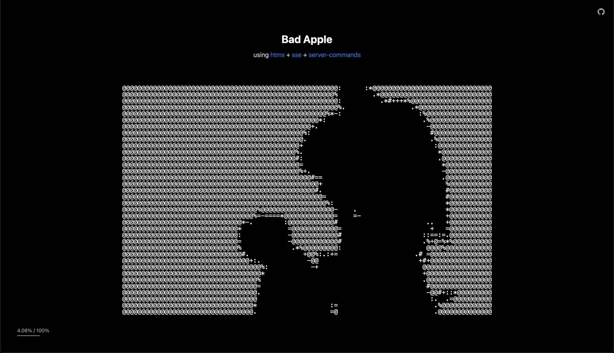

# Server Commands Extension

**TL:DR:**

The `server-commands` extension lets you send `<htmx>` tags from your server to update the DOM. 

Works with HTTP + [SSE](https://htmx.org/extensions/sse/) & [WebSockets](https://htmx.org/extensions/ws/) extensions.

It's only 1.6 KB minified & gzipped.

<a href="https://bad-apple.christiantanul.com/" target="_blank">
  
</a>

*[Bad Apple using htmx + sse + server-commands](https://bad-apple.christiantanul.com/)*

---


## Prerequisites

This extension requires htmx with [PR #3425](https://github.com/bigskysoftware/htmx/pull/3425) merged, which exposes history functions to extensions.

Until then, you can test it out with the modified htmx build:

```html
<script src="https://raw.githack.com/scriptogre/htmx/feature/expose-history-functions/src/htmx.js"></script>
```

---


## Quick Start Examples


### 1. Using HTTP (`hx-get`/`hx-post`)

**Client:**
```html
<head>
    <script src="https://raw.githack.com/scriptogre/htmx/feature/expose-history-functions/src/htmx.js"></script>
    <script src="https://raw.githack.com/scriptogre/htmx-extensions/feature/server-commands/src/server-commands/server-commands.js"></script>
</head>

<body hx-ext="server-commands">
    
    <button hx-get="/updates" hx-swap="none">  <!-- Without hx-swap="none", the button disappears after click. Here's an explanation why: https://github.com/bigskysoftware/htmx/issues/2742#issuecomment-2238495108 -->
        Click Me
    </button>
    
    <div id="el">
        Original
    </div>

</body>
```
**Server (from `/updates`):**
```html
<htmx swap="innerHTML" target="#el">
    Updated
</htmx>
```


### 2. Using Server-Sent Events (SSE)

**Client:**
```html
<head>
    <script src="https://raw.githack.com/scriptogre/htmx/feature/expose-history-functions/src/htmx.js"></script>
    <script src="https://raw.githack.com/scriptogre/htmx-extensions/feature/server-commands/src/server-commands/server-commands.js"></script>
    <script src="https://cdn.jsdelivr.net/npm/htmx-ext-sse@2.2.2"></script>
</head>

<body hx-ext="server-commands,sse">

    <div sse-connect="/stream" sse-swap="message" hx-swap="none"></div>  <!-- Connect to /stream using SSE -->
    
    <div id="chat-messages">
        <!-- Messages appear here -->
    </div>
</body>
```

**SSE messages (from `/stream`):**
```html
data: <htmx swap="beforeend show:bottom" target="#chat-messages">
data:     <div>New message!</div>
data: </htmx>
```

**Notes:**

- Set `sse-swap="message"` on an element. Unnamed SSE events are delivered as `message`, so this value is the pass-through that lets your `<htmx>` fragments execute out of band.
  > When [PR #178](https://github.com/bigskysoftware/htmx-extensions/pull/178) merges, you can omit setting `sse-swap="message"`, making the setup simpler.

- Set `hx-swap="none"` on the `sse-swap` element to stop the default (main band) swap from clearing the element's content.
  > I’m building a `smart-swaps` extension that will detect out-of-band-only responses and auto-set `hx-swap="none"`, making the setup even simpler.


### 3. Using WebSockets (WS)

**Client:**
```html
<head>
    <script src="https://raw.githack.com/scriptogre/htmx/feature/expose-history-functions/src/htmx.js"></script>
    <script src="https://raw.githubusercontent.com/scriptogre/htmx-extensions/refs/heads/feature/server-commands/src/server-commands/server-commands.js"></script>
    <script src="https://cdn.jsdelivr.net/npm/htmx-ext-ws@2.0.2"></script>
</head>

<body hx-ext="server-commands,ws">

    <div ws-connect="/ws/stream"></div>  <!-- WS connection -->

    <div id="chat-messages"></div>

</body>
```

**WebSocket messages (from `/ws/stream`):**
```html
<htmx swap="beforeend show:bottom" target="#chat-messages">
    <div>New message!</div>
</htmx>
```

---

## Attribute Reference


### `target`

Works like [`hx-target`](https://htmx.org/attributes/hx-target/) attribute or [`HX-Retarget`](https://htmx.org/reference/#response_headers) response header. 

This attribute is **required** when you want to swap content (because there's no default value `this`, like in `hx-target`).

The following values are **supported**:
- `<CSS selector>`
- `find <CSS selector>`

And the following are **not**, because they don't make sense in this context:
- `this`
- `closest <CSS selector>`
- `next`
- `next <CSS selector>`
- `previous`
- `previous <CSS selector>`

```html
<htmx target="#el">  <!-- uses htmx.config.defaultSwapStyle (innerHTML) -->
    Updated content!
</htmx>
```


### `swap`

Works like [`hx-swap`](https://htmx.org/attributes/hx-swap/) attribute and [`HX-Reswap`](https://htmx.org/reference/#response_headers) response header, including full support for [modifiers](https://htmx.org/attributes/hx-swap/#modifiers).

```html
<htmx target="#items" swap="beforeend scroll:bottom">
    <div>New item</div>
</htmx>
```


### `select`

Works like [`hx-select`](https://htmx.org/attributes/hx-select) attribute and [`HX-Reselect`](https://htmx.org/reference/#response_headers) response header.

```html
<htmx target="#el" select=".result">
    <span>This will be discarded</span>
    <div class="result">Result</div>
</htmx>
```


### `trigger` / `trigger-after-swap` / `trigger-after-settle`

Works like [`HX-Trigger`](https://htmx.org/headers/hx-trigger/), [`HX-Trigger-After-Swap`](https://htmx.org/headers/hx-trigger/), and [`HX-Trigger-After-Settle`](https://htmx.org/headers/hx-trigger/) response headers.

```html
<htmx trigger="dataUpdated"></htmx>
<htmx trigger-after-swap='{"showMessage":{"level" : "info", "message" : "Here Is A Message"}}'></htmx>
<htmx trigger-after-settle='{"showMessage":{"target" : "#otherElement"}}'></htmx>
```


### `redirect`

Works like [`HX-Redirect`](https://htmx.org/headers/hx-redirect/) response header.

```html
<htmx redirect="/login"></htmx>
```


### `refresh`

Works like [`HX-Refresh`](https://htmx.org/reference/#response_headers) response header.

```html
<htmx refresh="true"></htmx>
<htmx refresh></htmx>  <!-- same as above -->
```


### `location`

Works like [`HX-Location`](https://htmx.org/headers/hx-location/) response header.

```html
<htmx location="/dashboard"></htmx>
<htmx location='{"path": "/dashboard", "title": "Dashboard"}'></htmx>
```


### `push-url`

Works like [`hx-push-url`](https://htmx.org/attributes/hx-push-url/) attribute and [`HX-Push-Url`](https://htmx.org/headers/hx-push-url/) response header.

```html
<htmx push-url="/new-page"></htmx>
```


### `replace-url`

Works like [`hx-replace-url`](https://htmx.org/attributes/hx-replace-url/) attribute and [`HX-Replace-Url`](https://htmx.org/headers/hx-replace-url/) response header.

```html
<htmx replace-url="/new-page"></htmx>
```

---

## Events

The extension provides the following events that you can hook into:

- `htmx:beforeServerCommand`: Fired before processing each `<htmx>` tag. You can call `event.preventDefault()` to cancel processing.
- `htmx:afterServerCommand`: Fired after successfully processing each `<htmx>` tag.
- `htmx:serverCommandError`: Fired when an error occurs during command processing.

```html
<!-- HTTP Example -->
<button hx-get="/updates"
        hx-swap="none"
        hx-on::before-server-command="event.preventDefault()"  <!-- Cancel processing -->
        hx-on::after-server-command="console.log(event)">
    Click Me
</button>
```

```html
<!-- SSE Example -->
<div sse-connect="/sse/stream" 
     sse-swap="message"
     hx-on::before-server-command="event.preventDefault()"  <!-- Cancel processing -->
     hx-on::after-server-command="console.log(event)"></div>
```
```html
<!-- WS Example -->
<div ws-connect="/ws/stream" 
     hx-on::before-server-command="event.preventDefault()"  <!-- Cancel processing -->
     hx-on::after-server-command="console.log(event)"
></div>
</div>
```

Swaps done via `<htmx>` commands also trigger the standard htmx events (like `htmx:beforeSwap`, `htmx:afterSwap`, etc) on the target elements.

---

## Future Ideas

The `<htmx>` tag could potentially support new commands, like:

```html
<!-- Add/remove/toggle attributes & classes -->
<htmx target="#checkbox" add:checked></htmx>
<htmx target="#checkbox" remove:checked></htmx>
<htmx target="#el" add:class="new-class"></htmx>
<htmx target="#el" remove:class="old-class"></htmx>
<htmx target="#el" set:style="--progress: 70%"></htmx>

<!-- Create a cool synergy with _hyperscript -->
<htmx _="set $el's innerText to 'Hello'"></htmx>

<!-- Call a JS function -->
<htmx call:myFunction call:myFunctionWithArgs="arg1,arg2"></htmx>
```

The `<htmx>` tag provides an API to do surgical updates upon the DOM, directly from the server.

---

## Experimental Notice

This extension is experimental and under heavy development. Expect breaking changes.
